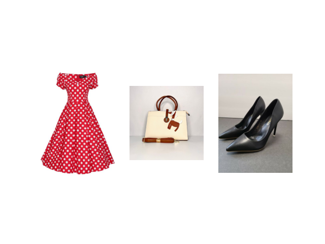
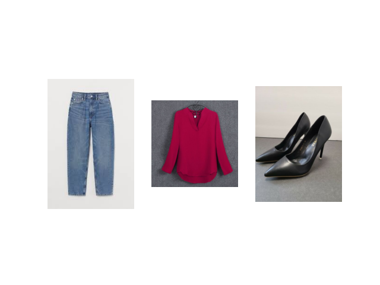
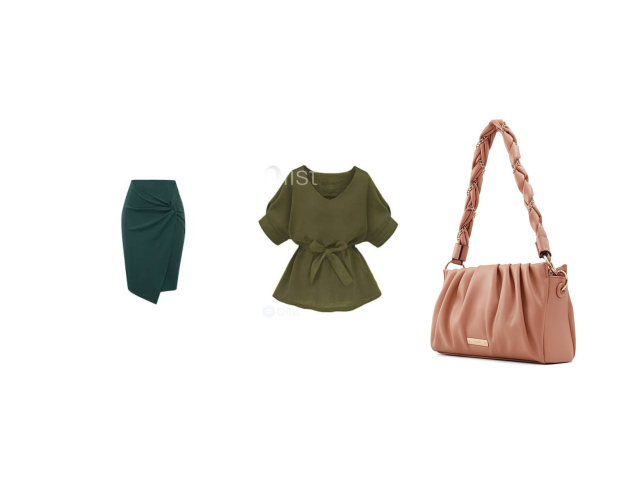
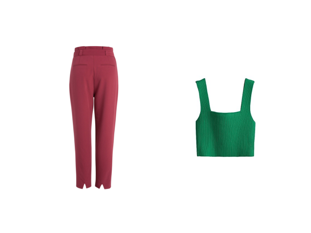
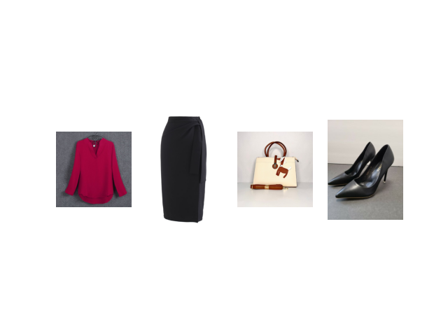
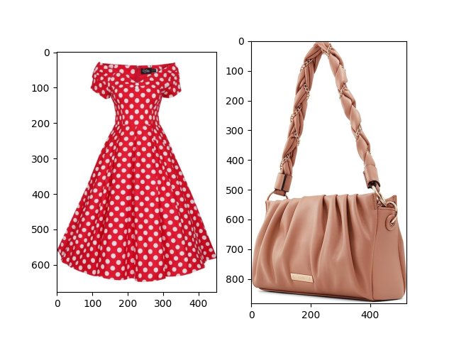
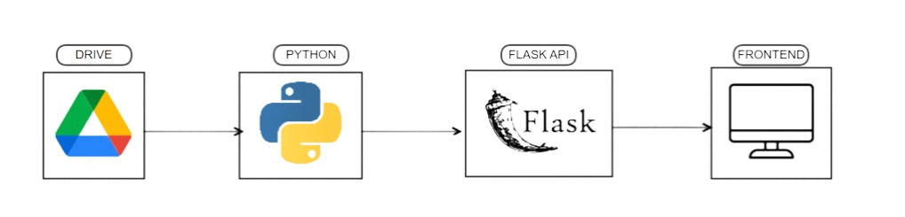

# StyleMe-Clothing-Recommendation-System
What if you didn't have to worry what to wear everyday? What if you had a trustee application to help pick outfits for you? This is exactly what the styleme clothing recommendation system does.


## Some outfit combinations
<div style="display: flex; justify-content: space-between;">
  
  
  
</div>

<br>

<div style="display: flex; justify-content: space-between;">
  
  
  
</div>


# Table Of Contents
* [Installation](https://github.com/Jess607/StyleMe-Clothing-Recommendation-System#installation)
* [Architecture](https://github.com/Jess607/StyleMe-Clothing-Recommendation-System#architecture)
* [About the Project](https://github.com/Jess607/StyleMe-Clothing-Recommendation-System#about-the-project)
* [How To Use](https://github.com/Jess607/StyleMe-Clothing-Recommendation-System?tab=readme-ov-file#how-to-use)
* [Licensing And Authors](https://github.com/Jess607/StyleMe-Clothing-Recommendation-System#licensing-and-authors)

# Installation 
All packages needed to run the code are available in the `requirements.txt file`. To install simply run:

```bash
pip install -r requirements.txt
```


# Architecture


# About The Project 
The StyleMe Clothing Recommendation System is a system that helps individuals create daily outfit recommendations based on input (pictures) provided by said user in a virtual wardrobe. Like the architecture suggests, users provide pictures of outfits in their wardrobe which is then uploaded to an object storage (google drive in our case). In a virtual wardrobe, users have separate folders for different outfit pieces (dresses, pants, shirts, skirts and shoes). 
The recommendation system uses two distinct methods to generate recommendations; the cosine similarity and a color histogram similarity. With these two algorithms, we are able to provide various combinations of outfits for users taking away the hassle of thinking about outfits. As this is a backend system, all of these are encapsulated in an API which returns the ids of the various outfit pieces to the frontend which is then displayed to the user. In order to call the API, all the forntend does is enter the folder ids for the user and then the system takes over.
An amazing feature of the recommendation system is its ability to provide outfit recommendations depending on what is present in the user's virtual wardrobe. So if a user has just pants and shirts in their virtual wardrobe, best outfit recommendations will be created based on just those pants and shirts


# How To Use 
### Clone the Repository

1. Open your terminal or command prompt.
2. Clone the repository using the following command:

    ```bash
    git clone <your-repo-url>
    ```

3. Navigate to the project directory:

    ```bash
    cd <your-repo-name>
    ```

### Set Up the Virtual Environment

1. Create a virtual environment:

    ```bash
    python3 -m venv myenv
    ```

2. Activate the virtual environment:

    - On macOS/Linux:

        ```bash
        source myenv/bin/activate
        ```

    - On Windows:

        ```bash
        myenv\Scripts\activate
        ```

3. Install the required packages:

    ```bash
    pip install -r requirements.txt
    ```


# Licensing And Authors
This code was created by Jessica Ogwu under the GPL-3.0 license. Please feel free to use the resources as you deem fit.
